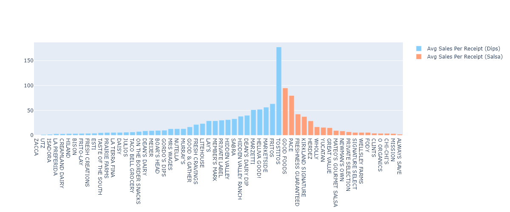

Hello,

Thank you for your patience. Please see the file  for the results after investigating some of the questions previously provided. The analysis took some time to complete because of some data quality issues present in the files. Most of the time, the issues are minor and easily dealt with. However, there are some key issues that I have noticed that should be followed-up on when possible and warrants a quick summary:

#1: Row/ID duplications in tables. This is highly apparent in TRANSACTION_TAKEHOME.csv, where only about 24,440 records out of 50,000 are truly unique when evaluating by the ID (receipt_id). Interestingly the duplications looks like they came in sets of twos (2, 4, 6), so it's likely a systemmatic error. This has to be dealt with because it can severely bias the results when putting in a query. The script I've written to try to de-duplicate the files works well in the meantime but it does take a while since it's a script that rolls functions into itself- sort of like the movie Inception with a "dream within a dream". A more permanent solution or process repair (depending on the cause) should be made to save time in the future. 

#2: The "brand" column in PRODUCTS_TAKEHOME.csv contains many rows without values. This is unfortunate because it does limit the scope of what the results can provide. It doesn't tell us what specific product has certain trends. For example, there's a total of about 845,000 records in PRODUCTS_TAKEHOME and 226,472 does not have brands even though there are only 111 records without a major category (category_1) and 1,424 records without a minor category (category_2). Finding answers by categories is only fruitful in a generalized sense as brands give specific identifications to market movers. My suggestion is to allocate some help in trying to complete this column.

#3: There are gaps in the IDs from USER_TAKEHOME.csv and the user_id in TRANSACTION_TAKEHOME.csv. This is highly bias and should be immediately focsued on resolving. Not only does it create a gap between these two tables, it also means there might be gaps with user IDs in other tables, which can be a huge problem if we want to filter our results for qualified information based on users because much of the information will be lost. I'll elaborate more below with an intersting finding. 

While investigating the question of who the leading brand is for "Dips & Salsas" category, I found that it was not suitable to group the two, "Dips" and "Salsas" together. Thus, I separated the two based on their subcategory when running the query. I strongly believe that TOSTITOS (total sale: 177.32) is the leading brand in dips and GOOD FOODS (total sale: 94.91) is the leading brand in salas. For TOSTITOS, the next runner-up is FRITOS, which only has about 1/3 in total sales (63.18). For GOOD FOODS, the next runner-up is PACE, which is very close with 79.73 in total sales. However, if we take the average sales per transaction, we'll find that GOOD FOODS is surprising high at 10.55 with 9 transactions as compared to PACE, which has 3.62 with 22 transactions. We can discuss this further, but I personally feel that this shows a potential quality vs quantity situation with a ratio of nearly 1 : 2.5 transactions between the two. Most would try the cheaper option at least once, but would prefer the more costly option if it's better. Please see the figure  for a visual on the two subcategories based on total sales.

I found this interesting information only because I decoupled the user ID information during the search. If I had compared it to the users table to qualify users (users that were within the age of majority for using our platform), this would've given very underrated results. It would have shown MARKETSIDE as the leading brand for dips with a total sale of 56.3 from a single user, and no brand for salsas. This would have severely limited some insights for us.

This also presents some opportunities to work on. I would like to request additional support in informational gathering on brands in order to imrpove the table in PRODUCTS_TAKEHOME, which will give us more insight with the transactions in TRANSACTION_TAKEHOME. This will improve the quality of results in the future when we try to find "leading brands" in other arenas. I would also like to request support with investigating why transactions are being duplicated. Had the table not been groomed with my script before querying, the results may be impacted based on how the SQL statement was written, which makes the risk of getting bad information more likely. Additionally, this duplication eats up virtual space that will cost us down the road to store information as the number of transactions increases. Instead of adding 1 row per transaction, we'll be adding 2+ rows per transaction, which doubles (at the minimum) the storage space. Please feel free to reach out if more information is needed. Thank you!

Best,

Brian